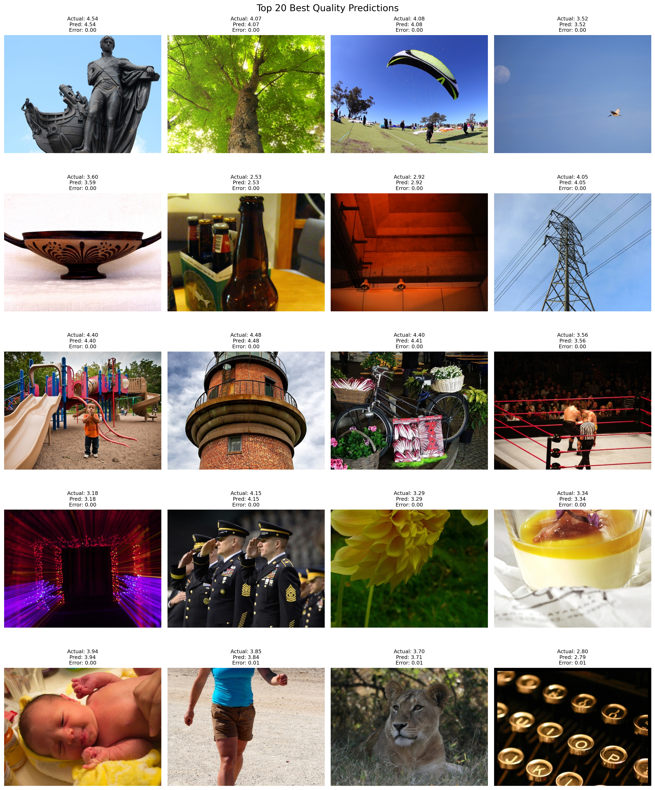
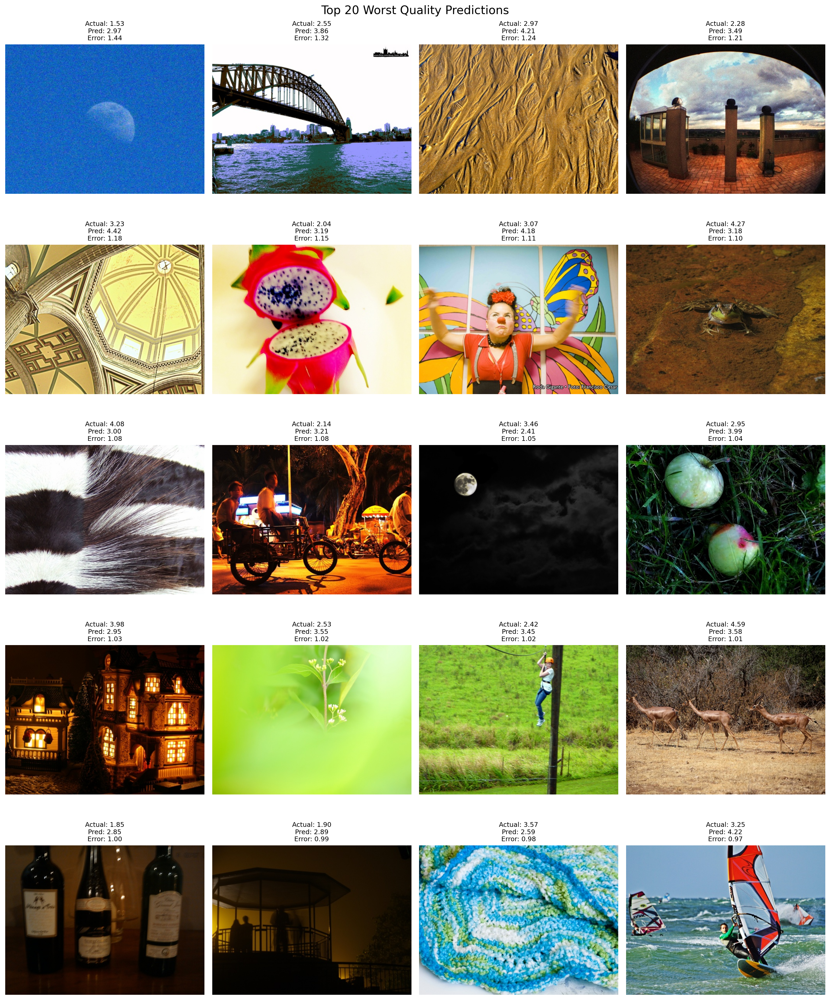
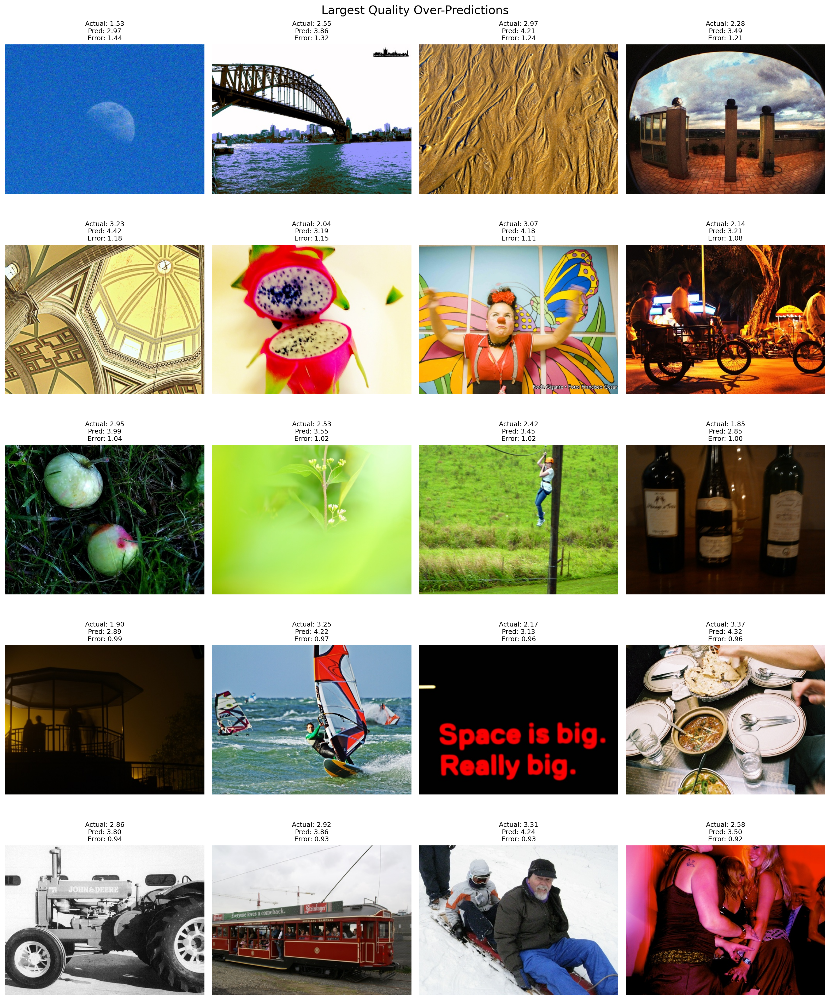
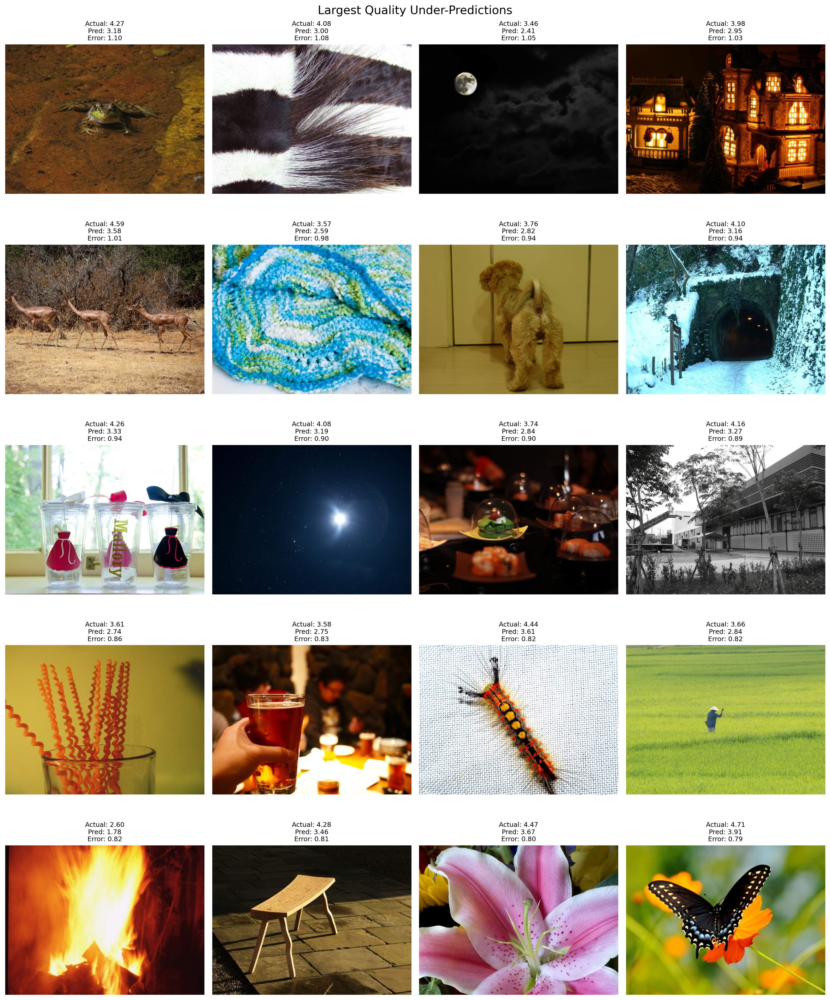

# Viora AI — Technical Documentation

## 1. Project Overview

Viora AI is a local web application for estimating perceptual image quality and scoring six visual-degradation categories. Its input is one uploaded image. Its output includes a 0–100 quality score, qMOS (0–5), an ordinal quality label, six probability-like defect scores, OpenCV statistics, a text recommendation, static URLs for the stored original and optional Grad-CAM overlay, and a persistence status.

The browser uploads an image with a session identifier. FastAPI validates it, invokes the hybrid model, writes the image and Grad-CAM result locally, and attempts to persist the result in MongoDB. The React result page displays the returned data immediately; a history page can retrieve the same session’s stored records later.

## 2. System Architecture

```text
React/Vite browser
  ├─ Home: choose image → POST /api/predict?session_id=…
  ├─ Results: render scores, statistics, original, Grad-CAM
  └─ History: GET/DELETE /api/analyses using the same session_id
                         ↓
FastAPI application
  ├─ validation and upload-size enforcement
  ├─ prediction service
  │    └─ QualityPredictor
  │         ├─ BGR image → RGB 224×224 tensor → ResNet18
  │         ├─ BGR image → 8 OpenCV features → normalization → MLP
  │         ├─ concatenate embeddings → fusion MLP
  │         ├─ sigmoid quality head → qMOS / score / label
  │         └─ sigmoid 6-output defect head
  └─ Grad-CAM from ResNet layer4[-1].conv2
                         ↓
  MongoDB `predictions` collection       local UPLOAD_DIR
                                          ├─ {prediction_id}.jpg
                                          └─ gradcam/{prediction_id}.jpg
```

The backend mounts `UPLOAD_DIR` at `/uploads`, so saved files are available as API-relative static URLs.

## 3. Repository Structure

```text
backend/
├─ app/
│  ├─ main.py                         app, lifespan, CORS, static files
│  ├─ config.py, database.py          settings and PyMongo collection
│  ├─ routes/                         prediction, analysis, health, metadata
│  ├─ services/                       inference, Grad-CAM, image utilities
│  └─ models/prediction.py            persisted prediction shape
├─ ml/
│  ├─ config.py, model.py, predict.py hybrid inference implementation
│  ├─ dataset.py, features.py          dataset and eight feature extractors
│  ├─ defect_targets.py               deterministic synthetic labels
│  ├─ train.py, evaluate.py            training and held-out evaluation
│  ├─ train_cv_baseline.py, cnn_only.py baselines
│  ├─ failure_analysis.py, gradcam.py  report/standalone Grad-CAM tools
│  ├─ artifacts/                      checkpoint and normalization files
│  └─ reports/                        generated JSON, CSV, PNG reports
├─ Dockerfile
└─ requirements.txt
frontend/
├─ src/pages/                         Home, Results, History
├─ src/components/                    uploader, scores, charts/images, metadata
├─ src/services/api.js                fetch client and session handling
├─ src/hooks/useAnalysis.js           request state
└─ src/App.jsx                        browser routes
docker-compose.yml
```

`app/services/image_analyzer.py` is a separate general image-statistics helper; production prediction statistics come from `ml/features.py` through `QualityPredictor`. `app/models/analysis.py` and `app/schemas/analysis.py` define an older analysis-shaped model/schema and are not used by the implemented routes; the live persistence path uses `app/models/prediction.py`.

## 4. Frontend Architecture

`App.jsx` defines three React Router routes: `/` (Home), `/results/:id?` (Results), and `/history` (History). Home combines `ImageUploader`, `ImagePreview`, `useAnalysis`, and `ModelInfo`. The uploader accepts JPEG/PNG/WebP in the browser and sends the selected file through `predictImage`.

`src/services/api.js` creates and saves a UUID in `sessionStorage` under `viora-analysis-session-id`. It appends that ID to prediction, history, detail, and deletion requests. `VITE_API_BASE_URL` controls the API origin and otherwise defaults to `http://127.0.0.1:8000`.

After a prediction, Home navigates with the returned object in route state. Results can instead reload a stored record with `getAnalysis(id)`. It prefixes relative `image_url` and `gradcam_url` values with the API origin, then renders `QualityScore`, `IssueList`, `Statistics`, and `HeatmapViewer`. History obtains up to 20 records, opens one at `/results/{prediction_id}`, or deletes it. `IssueList` renders all returned defect values sorted descending and assigns UI-only severity bands: High ≥0.7, Medium ≥0.4, Low otherwise.

## 5. Backend Architecture

`app/main.py` creates the FastAPI app, mounts `/uploads`, enables configured CORS origins, checks MongoDB on startup, and closes the client on shutdown. It exposes `/` plus four route modules.

| Module | Responsibility |
|---|---|
| `routes/prediction.py` | multipart upload route, MIME/empty/size checks, error mapping |
| `routes/analysis.py` | session-filtered history, lookup, and deletion |
| `routes/health.py` | database ping and model availability status |
| `routes/model_info.py` | active `model_metadata.json` fields |
| `services/prediction_service.py` | inference, score labels/recommendation, files, persistence |
| `services/explainability_service.py` | quality-output Grad-CAM overlay |
| `database.py` | `MongoClient`, database, `predictions` collection |
| `config.py` | dotenv loading and path/settings defaults |

The process initializes `QualityPredictor()` at import time. Consequently, the active checkpoint and its normalization arrays must exist before the API process can start.

## 6. API Documentation

### `POST /api/predict`

- **Purpose:** analyze and optionally persist an image.
- **Parameters:** required query `session_id` (1–128 characters).
- **Body:** `multipart/form-data` with required `file` field.
- **Allowed content types:** `image/jpeg`, `image/png`, `image/webp`, `image/bmp`; maximum size is `MAX_FILE_SIZE_MB` (10 by default).
- **Response:** `prediction_id`, `filename`, `image_url`, `quality_score`, `qmos`, `quality_label`, `defects`, `statistics`, `recommendation`, `gradcam_url` (nullable), and `persistence_status` (`stored` or `unavailable`). `defects` maps the six labels to values; `statistics` maps the eight feature names to values.
- **Errors:** 400 unknown type/empty upload, 413 size exceeded, 422 undecodable image, or 500 prediction failure. FastAPI returns 422 for a missing/invalid `session_id` or missing form field.

```bash
curl -X POST "http://127.0.0.1:8000/api/predict?session_id=<session-id>" \
  -H "accept: application/json" -F "file=@sample.jpg"
```

### `GET /api/history`

- **Purpose:** newest-first records for one browser session.
- **Parameters:** required `session_id`; optional `limit`, clamped from 1 to 100 (default 20).
- **Response:** JSON array of prediction documents without MongoDB `_id`.
- **Errors:** request validation errors for an absent/invalid `session_id`; database errors are not converted by this route.

```bash
curl "http://127.0.0.1:8000/api/history?session_id=<session-id>&limit=20"
```

### `GET /api/analyses/{prediction_id}`

- **Purpose:** retrieve one stored analysis for the requested session.
- **Parameters:** path `prediction_id`; required query `session_id`.
- **Response:** one prediction document without `_id`.
- **Errors:** 404 `{"detail":"Analysis not found."}` if no record matches both ID and session; request validation errors for session input.

```bash
curl "http://127.0.0.1:8000/api/analyses/<prediction-id>?session_id=<session-id>"
```

### `DELETE /api/analyses/{prediction_id}`

- **Purpose:** remove one matching document, its `{prediction_id}.jpg` original, and its Grad-CAM file when present.
- **Parameters:** path `prediction_id`; required query `session_id`.
- **Response:** `{"message":"Analysis deleted successfully."}`.
- **Errors:** 404 when no matching session record exists; filesystem/database failures are not translated by this route.

```bash
curl -X DELETE "http://127.0.0.1:8000/api/analyses/<prediction-id>?session_id=<session-id>"
```

### `GET /api/model-info`

- **Purpose:** expose the saved active model metadata.
- **Response:** `name`, `version`, `architecture`, `defect_targets`, and `quality_target`. If metadata is absent, the route returns only Unknown/Unavailable placeholders.

```bash
curl http://127.0.0.1:8000/api/model-info
```

### `GET /health` and `GET /`

`GET /health` returns `status: "ok"`, database state (`connected`/`disconnected`), and model state (`loaded`/`unavailable`). `GET /` returns application/version metadata and the `/docs` and `/health` paths.

## 7. Database Documentation

`MONGODB_URI` defaults to `mongodb://localhost:27017`; `DATABASE_NAME` defaults to `image_quality_db`. `database.py` opens a PyMongo client with a five-second server-selection timeout and uses `database["predictions"]`.

The live document is constructed by `create_prediction_document` and assigned the UUID prediction ID as MongoDB `_id` before insert:

```json
{
  "_id": "<prediction-id>",
  "prediction_id": "<prediction-id>",
  "session_id": "<browser-session-id>",
  "filename": "photo.jpg",
  "image_url": "/uploads/<prediction-id>.jpg",
  "gradcam_url": "/uploads/gradcam/<prediction-id>.jpg",
  "quality_score": 0.0,
  "qmos": 0.0,
  "quality_label": "Excellent | Good | Fair | Poor | Very Poor",
  "defects": { "blur": 0.0 },
  "statistics": { "brightness": 0.0 },
  "recommendation": "...",
  "created_at": "UTC datetime"
}
```

Insertion failure does not discard a usable prediction response: the API sets `persistence_status` to `unavailable`. Such an unpersisted analysis will not appear in history. Reads and deletion constrain both `prediction_id` and `session_id`, which enables reopening only from the originating browser session.

## 8. Image Storage

`UPLOAD_DIR` is created at startup (default `backend/uploads` when run from the backend configuration). The original is decoded with OpenCV and rewritten as `{prediction_id}.jpg`; Grad-CAM is saved as `gradcam/{prediction_id}.jpg`. The relative URLs are `/uploads/{prediction_id}.jpg` and `/uploads/gradcam/{prediction_id}.jpg`. FastAPI’s static mount serves them, and the frontend combines a relative URL with `VITE_API_BASE_URL`. The persisted URLs allow a reopened record to reference its files until deletion.

## 9. Machine Learning Model

### Preprocessing and features

`QualityPredictor` decodes bytes with `cv2.imdecode(..., IMREAD_COLOR)` (BGR), calculates features in `ml/features.py`, converts BGR to RGB, resizes to 224×224 with `INTER_AREA`, converts HWC to CHW float tensor, and divides pixel values by 255. It does **not** apply ImageNet mean/std normalization.

The eight OpenCV features are: grayscale brightness (`mean/255`), contrast (`std/255`), log-transformed Laplacian-variance sharpness, Gaussian-residual noise level, normalized grayscale entropy, HSV saturation mean, dark-pixel ratio (`gray <= 20`), and bright-pixel ratio (`gray >= 235`). `feature_mean.npy` and `feature_std.npy` hold train-fitted per-feature values. In inference, `(features - mean) / std` is used; near-zero standard deviations are replaced by 1.0.

### CNN, fusion, and heads

`ImageQualityNet` starts from `torchvision` pretrained ResNet18 (`ResNet18_Weights.DEFAULT`) and replaces its final classifier with identity, yielding the ResNet image embedding. The handcrafted branch is `Linear(8,32) → ReLU → BatchNorm1d → Dropout(0.15)`. Concatenated image/feature embeddings enter `Linear(...,128) → ReLU → BatchNorm1d → Dropout(0.30)`.

The quality head is `128 → 64 → 1` with ReLU, 0.20 dropout, and sigmoid. Its normalized 0–1 result is clipped, multiplied by 5 for qMOS, and multiplied by 100 for quality score. Labels use qMOS thresholds: Excellent ≥4.0; Good ≥3.5; Fair ≥2.5; Poor ≥1.5; otherwise Very Poor. The defect head has the same `128 → 64 → 6` pattern with sigmoid outputs in this order: blur, underexposure, overexposure, noise, corruption, defect.

### Active artifact

Inference loads `ml/artifacts/image_quality_model.pt`. Its `model_metadata.json` declares version `1.0.0`, `Pretrained ResNet18 + OpenCV features`, and all six defect targets. The promotion script verifies candidate labels/metadata against the required exact order and copies the candidate checkpoint and metadata to those active filenames. Therefore six-label support is active, not merely documented.

## 10. Dataset

The pipeline uses the included KonIQ++ CSV and images under `backend/ml/data/raw/koniq/`. `prepare_koniq.py` validates filenames and numeric quality/distortion columns, then uses random seed 42 for a 70%/15%/15% split. The processed files contain 7,051 training, 1,511 validation, and 1,511 test samples (10,073 total). qMOS is normalized by `/5.0` for model training.

KonIQ++ has five broad annotation-frequency columns, but they are intentionally not mapped to the application’s six categories. Clean quality evaluation uses unmodified images and zero defect targets. Six-label training/evaluation uses the synthetic targets described next.

## 11. Six-Label Defect Target Generation

`defect_targets.py` derives a deterministic seed from the first eight bytes of the SHA-256 digest of the filename. `seed % 7` assigns one of six labels; the seventh outcome is clean. A NumPy generator initialized from the same seed selects reproducible transform parameters. This happens after CSV splitting and is applied independently inside each split; it does not use held-out images to fit training parameters.

| Label | Synthetic transformation |
|---|---|
| blur | Gaussian blur with sigma 2.0–4.0 |
| underexposure | `convertScaleAbs` alpha 0.22–0.45 |
| overexposure | alpha 1.4–1.9 plus beta 35–79 |
| noise | zero-mean Gaussian noise, standard deviation 20–38 |
| corruption | pixelation plus JPEG encode/decode quality 8–19 |
| defect | opaque black rectangle plus white line |

These are deterministic proxy labels for known transformations, **not human annotations**. The test defect dataset uses transformed held-out image identities; the clean test dataset remains separate for qMOS metrics.

## 12. Training Pipeline

`train.py` chooses MPS, then CUDA, then CPU; seeds Python, NumPy, and PyTorch with 42; uses batch size 32, 20 configured epochs, learning rate `1e-4`, AdamW weight decay `1e-4`, and `NUM_WORKERS=0`. It calculates or reuses train-set feature normalization arrays.

For six-label fine-tuning, it loads the active legacy checkpoint while excluding `defect_head` weights, freezes every parameter except `defect_head`, trains binary cross-entropy for that head, clips gradients to 5.0, validates with SmoothL1 quality plus BCE defect losses, and schedules LR with `ReduceLROnPlateau(factor=0.5, patience=2)`. Early stopping patience is 5. The best validation checkpoint is saved first as `image_quality_model_candidate.pt`, with candidate metadata. Promotion requires the candidate, metadata, held-out defect report, exact label order, and successful state-dict load before copying it to the active names.

```bash
cd backend
source venv/bin/activate
export PYTHONPATH=.
python -u -m ml.train
MODEL_CHECKPOINT_PATH=ml/artifacts/image_quality_model_candidate.pt python -m ml.evaluate
python -m ml.promote_six_label_checkpoint
```

## 13. Model Artifacts

| Artifact | Purpose |
|---|---|
| `image_quality_model.pt` | active API checkpoint |
| `image_quality_model_candidate.pt` | candidate before promotion |
| `model_metadata.json` | active model/target metadata |
| `model_metadata_candidate.json` | candidate metadata |
| `feature_mean.npy`, `feature_std.npy` | feature normalization arrays |
| `feature_stats.json` | readable feature names, means, and standard deviations |
| `cnn_only_model.pt`, `cnn_only_metadata.json` | archived qMOS comparison baseline |
| `cv_baseline_model.joblib` | Random Forest handcrafted-feature baseline |

## 14. Grad-CAM Explainability

The active API uses `services/explainability_service.py`, targeting `model.backbone.layer4[-1].conv2`. It installs a forward hook for activations and a full backward hook for output gradients, forwards the actual image and feature tensors, and backpropagates the scalar quality prediction. It globally averages gradients across spatial axes to obtain per-channel weights, sums weighted activation maps, applies ReLU, normalizes when the maximum is positive, and resizes to the original image dimensions. OpenCV applies `COLORMAP_JET`; the image and heatmap are blended at 0.55/0.45 and stored as JPEG. Hooks are removed in `finally`.

The overlay indicates regions that influenced the predicted quality output. It is not ground-truth defect localization and does not establish causality.

## 15. Prediction Pipeline

1. The frontend sends `file` multipart data with `session_id`.
2. The route validates declared MIME type, empty bytes, and size.
3. `QualityPredictor` decodes the image, extracts/normalizes OpenCV features, and creates a CNN tensor.
4. The hybrid model produces normalized quality and six defect outputs.
5. The API derives qMOS, quality score, label, and recommendation (based on qMOS and highest defect score).
6. It writes the original image, then attempts Grad-CAM; Grad-CAM failure leaves `gradcam_url` null but does not fail prediction.
7. It builds a response and attempts MongoDB insertion; persistence failure returns `unavailable` status.
8. React renders the response or later fetches the saved record by ID and session.

## 16. Evaluation Methodology

`evaluate.py` evaluates qMOS on 1,511 clean held-out test samples, converting normalized targets/predictions to 0–5. It computes MAE, RMSE, Pearson linear correlation (PLCC), and Spearman rank correlation (SRCC). It separately creates deterministic synthetic defects on held-out identities and records regression errors, correlations, precision/recall/F1 at 0.5, ROC AUC, and average precision per label.

`train_cv_baseline.py` fits a 300-tree Random Forest on normalized handcrafted features; `evaluate_cnn_only.py` scores its archived ResNet18 baseline. `compare_models.py` writes the comparison CSV. `failure_analysis.py` ranks absolute error, positive error (over-prediction), and negative error (under-prediction) and produces contact sheets. `evaluate.py` produces the actual-vs-predicted scatterplot and error histogram.

## 17. Evaluation Results

### qMOS quality reports

| Model | MAE | RMSE | PLCC | SRCC |
|---|---:|---:|---:|---:|
| Random Forest CV baseline | 0.3958 | 0.5086 | 0.6894 | 0.6736 |
| CNN-only ResNet18 | 0.2993 | 0.3851 | 0.8367 | 0.8009 |
| Hybrid CNN + CV | 0.2883 | 0.3649 | 0.8566 | 0.8156 |

These values come from `cv_baseline_metrics.json`, `cnn_only_metrics.json`, and `metrics.json`/`model_comparison.csv`, each reporting 1,511 test samples where applicable.

### Six-label candidate report

`six_label_defect_evaluation.json` evaluates `image_quality_model_candidate.pt` on 1,511 deterministically transformed held-out samples. It reports qMOS MAE 0.3928, RMSE 0.5026, PLCC 0.8407, and SRCC 0.7990 for that run. Defect results:

| Label | Precision@0.5 | Recall@0.5 | F1@0.5 | ROC AUC | AP |
|---|---:|---:|---:|---:|---:|
| blur | 0.9700 | 0.9652 | 0.9676 | 0.9989 | 0.9945 |
| underexposure | 0.8037 | 0.4135 | 0.5460 | 0.9405 | 0.7353 |
| overexposure | 0.9167 | 0.3812 | 0.5385 | 0.8909 | 0.6865 |
| noise | 0.8688 | 0.8240 | 0.8458 | 0.9865 | 0.9292 |
| corruption | 0.9375 | 0.7674 | 0.8440 | 0.9905 | 0.9546 |
| defect | 0.6364 | 0.0628 | 0.1143 | 0.8480 | 0.4591 |

The reported values assess synthetic transformation recognition, not performance against human-labelled real-world defects.

Report assets include [quality actual vs. predicted](backend/ml/reports/quality_actual_vs_predicted.png), [quality error distribution](backend/ml/reports/quality_error_distribution.png), [best cases](backend/ml/reports/best_cases.csv), [worst cases](backend/ml/reports/worst_cases.csv), [over-predictions](backend/ml/reports/over_prediction_cases.csv), and [under-predictions](backend/ml/reports/under_prediction_cases.csv).

## 18. Failure Analysis

The failure-analysis script reads `test_predictions.csv`, defines signed qMOS error as predicted minus actual, and ranks 20 rows each for smallest absolute error, largest absolute error, largest positive error, and largest negative error. When synthetic defect columns are present, it also identifies the expected and highest predicted defect label and gives a cautionary inspection note. It writes the four CSVs plus best/worst/over/under contact sheets and an error-distribution image. These artifacts support manual inspection; they do not themselves demonstrate causal error explanations.

## 19. Sample Images

The project contains raw KonIQ++ images and generated report contact sheets. The latter are the directly documented examples, because they are curated by the evaluation scripts rather than manually labelled as particular conditions:









No repository asset was found that reliably labels an individual raw image as each of the six conditions, so this documentation does not assign invented condition labels to raw filenames.

## 20. Testing

The repository contains evaluation/training scripts and generated reports, but no dedicated automated test suite or CI configuration was found. The following are appropriate checks based on available scripts; they are commands, not claims of a recorded passing run:

```bash
cd backend
source venv/bin/activate
export PYTHONPATH=.
python -m compileall app ml
python -m ml.evaluate
python -m ml.failure_analysis
python -m ml.gradcam

cd ../frontend
npm run lint
npm run build
```

API and database behavior can be checked manually with the curl examples in this document once MongoDB, artifacts, and the backend are available. No separate test records for API routes, MongoDB operations, frontend lint/build, inference, or Grad-CAM execution were found.

## 21. Docker / Docker Compose

`docker-compose.yml` defines:

| Service | Image/build | Host port | Persistent volume |
|---|---|---:|---|
| `mongodb` | `mongo:8` | 27017 | `mongodb_data:/data/db` |
| `backend` | `./backend` Dockerfile | 8000 | `backend_uploads:/app/uploads` |
| `frontend` | `./frontend` Dockerfile | 5173 | none |

The Compose backend supplies `MONGODB_URI=mongodb://mongodb:27017` and selected configuration variables. Build/start/stop commands are:

```bash
docker compose build
docker compose up
docker compose down
```

The frontend image runs Vite development mode with `--host 0.0.0.0`; the backend runs Uvicorn on port 8000. There is no Compose health check, no configured frontend `VITE_API_BASE_URL`, and no `CORS_ORIGINS` environment assignment. Critically, `backend/Dockerfile` does not copy `ml/artifacts`; therefore its API import cannot find `image_quality_model.pt`. The supplied container configuration is not sufficient for running model inference without that change.

## 22. Deployment

The repository supports local configuration through environment variables, configurable CORS, API-origin configuration for the frontend, Dockerfiles, Compose service definitions, and local/static upload storage. It has no provider configuration, infrastructure-as-code, production process manager, object storage integration, deployment URL, or documented remote database setup beyond a generic MongoDB URI example. A deployment must arrange model artifacts, persistent image storage, a reachable MongoDB instance, CORS origins, and frontend API URL itself.

## 23. Security / Configuration Considerations

- Keep `.env` out of source control; use credential placeholders in documentation.
- Configure `CORS_ORIGINS` narrowly for deployed browser origins. The middleware allows credentials and all HTTP methods/headers for those configured origins.
- The route trusts the declared upload `content_type` for type policy, then decodes the content with OpenCV. It enforces max byte size but does not perform malware scanning or authentication.
- History isolation is based on a UUID kept in browser session storage, not user authentication; session identifiers should be treated as access tokens for history records.
- Original images and Grad-CAM overlays reside on local filesystem paths and are publicly reachable through the `/uploads` mount if their URLs are known.
- MongoDB availability affects historical persistence but does not prevent an in-memory prediction response.

## 24. Limitations

- The six defect labels are synthetic proxy targets, not human annotations.
- The `defect` synthetic transformation performs poorly at F1@0.5 in the generated candidate report (0.1143).
- Grad-CAM highlights input regions associated with quality output; it is not defect ground truth or a causal explanation.
- Generalization depends on the KonIQ++ training distribution and chosen transformations.
- The API uses local image storage, which is unsuitable for scalable multi-instance production without shared/object storage.
- Session IDs are not an authentication/authorization system.
- The Docker inference deployment is incomplete because model artifacts are not copied into the backend image.

## 25. Future Improvements

Potential improvements, not current features, include collecting human-annotated defect data, calibrating defect probabilities, adding real defect localization, testing alternative architectures, using managed object storage, adding authentication and robust access controls, adding automated tests/CI, and production monitoring.

## 26. Assignment Requirements Mapping

| Assignment Requirement | Implementation / Location |
|---|---|
| Setup | `README.md` Quick Start and environment section |
| Model/training | this document; `backend/ml/model.py`, `train.py` |
| API | `backend/app/routes/` and API section above |
| Database | `backend/app/database.py`, `models/prediction.py` |
| Evaluation | `backend/ml/reports/`, `evaluate.py`, comparison/failure scripts |
| Technical explanation | `DOCUMENTATION.md` |
| Sample images | report contact sheets and report assets |
| Docker | `backend/Dockerfile`, `frontend/Dockerfile`, `docker-compose.yml` (with documented artifact limitation) |
| Deployment | configuration-only support; no cloud deployment configuration present |
